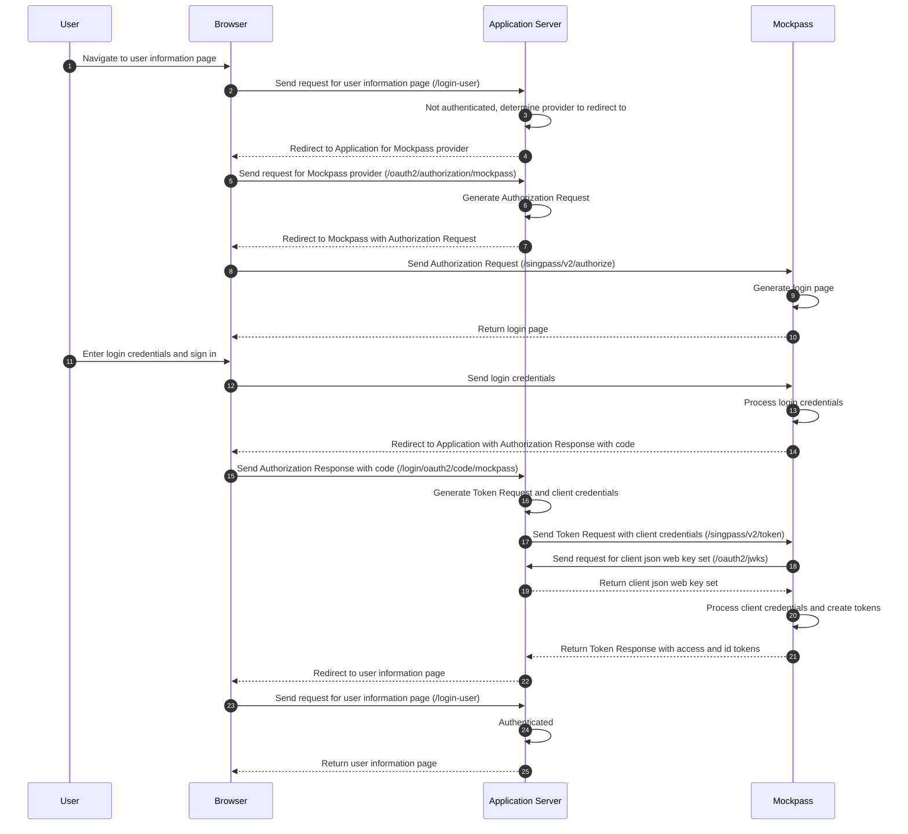

# Spring Boot Example OpenID Connect Relying Party for Singpass/Corppass

This project is an example implementation of a OpenID Connect Relying Party built using Spring Boot and Spring Security OAuth2 Client.

[MockPass](https://github.com/opengovsg/mockpass) is used as the public Identity Provider for testing purposes

## Quick Start

### Configuring MockPass as the Identity Provider

The Spring Boot application exposes its JWKS at http://localhost:8080/oauth2/jwks

```shell
set SHOW_LOGIN_PAGE=true
set SP_RP_JWKS_ENDPOINT=http://localhost:8080/oauth2/jwks
set CP_RP_JWKS_ENDPOINT=http://localhost:8080/oauth2/jwks
npx --y @opengovsg/mockpass
```

### Installing and running the Relying Party Spring Boot application

```shell
mvn spring-boot:run
```

### Testing the example Relying Party


| Description                        | Endpoint
|------------------------------------|-----------------------------------------------------
| Access the application             | http://localhost:8080/login-user
| Logout from the application        | http://localhost:8080/logout
| View the public keys               | http://localhost:8080/oauth2/jwks
| View Mockpass public keys          | http://localhost:5156/singpass/v2/.well-known/keys
| View Mockpass OpenID configuration | http://localhost:5156/singpass/v2/.well-known/openid-configuration

## Integration Details

The following things are needed to be configured in Spring for the integration
* Exposing the signature and encryption public keys via a JWKS endpoint
* Use `private_key_jwt` client authentication with the `aud` claim set to the `iss` value and the `typ` header set to `JWT`
* ID token needs to be decrypted with the private decryption key and signature verified against the Identity Provider's JWKS endpoint

Note that this example does not securely store the private keys which are located in `src/main/resources/jwks.json`. This should be securely stored and rotated, for instance on AWS this should be stored in AWS Secrets Manager with a Secrets Manager Rotation Lambda. This can be configured in Spring using [Spring Cloud AWS Secrets Manager](https://github.com/awspring/spring-cloud-aws).

### Json Web Key Sets

Mockpass will call the endpoint http://localhost:8080/oauth2/jwks in order to get the public keys of the application
* The public encryption key used for Mockpass to encrypt the ID Token to send to the application
* The public verification key used for Mockpass to verify the signature for the `private_key_jwt` client assertion

The `JWKSet` `@Bean` used by the application is produced in `WebSecurityConfiguration` and its public keys are exposed using the `@RestController` `JwksController`. Note that `JWKSet.toString()` removes the private components of the keys.

### Client Authentication

Mockpass requires the use of `private_key_jwt` client authentication.

Spring needs to be configured to use this client authentication method, and the token response client needs to be configured to use the appropriate private key to perform the signing as well as to set the `aud` claim to the issuer value.

```yaml
spring:
  security:
    oauth2:
      client:
        registration:
          mockpass:
            client-id: mockpass-spring-boot-example
            client-authentication-method: private_key_jwt
            authorization-grant-type: authorization_code
            scope:
            - openid
```

The `DefaultAuthorizationCodeTokenResponseClient` is used with the `NimbusJwtClientAuthenticationParametersConverter` configured with the private key and `NimbusJwtClientAuthenticationParametersConverter` used to customize the claims and headers on the client assertion.

### Decrypting ID Token

A `JwtDecoderFactory<ClientRegistration>` `@Bean` needs to be exposed to customize how the ID Token is decoded. A `DefaultJWTProcessor<SecurityContext>` is used with the `JWEKeySelector` and `JWSKeySelector` with the application's private decryption key to decrypt the ID Token and Mockpass's verification key to verify the signature on the ID Token. The verification keys from Mockpass are obtained by querying Mockpass's JWKS endpoint.

## Flow

